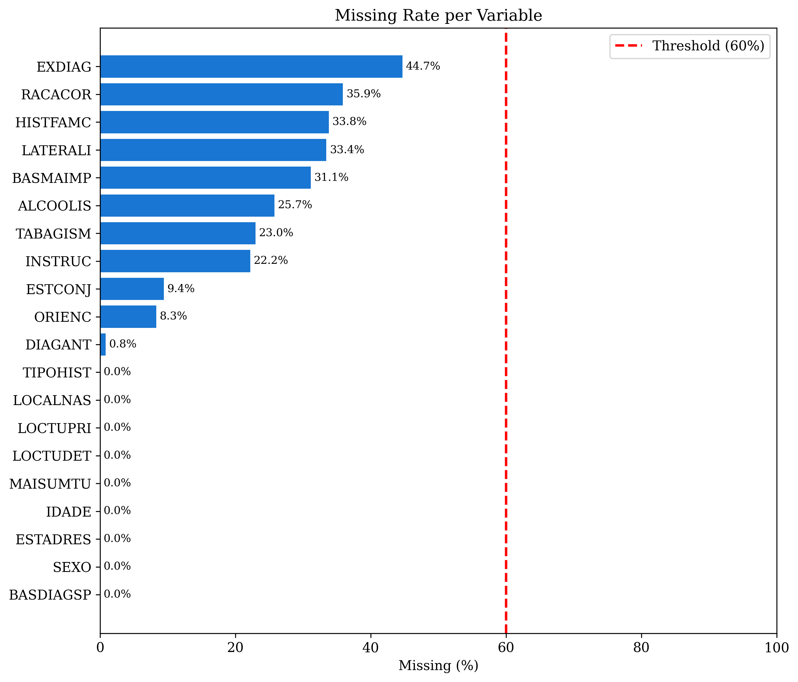
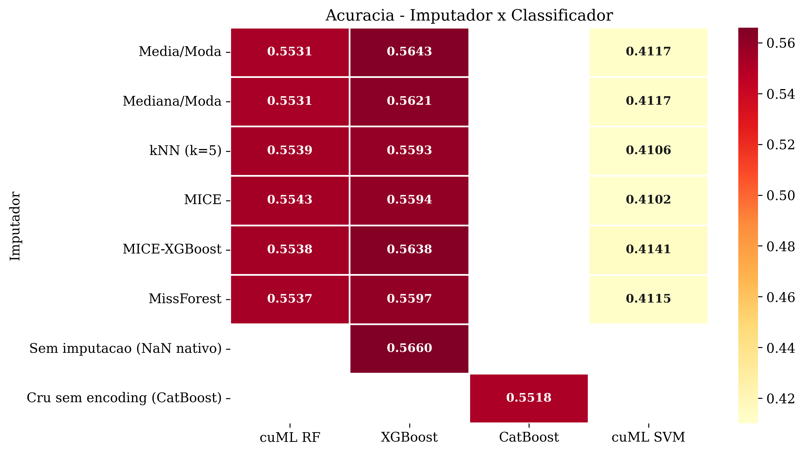
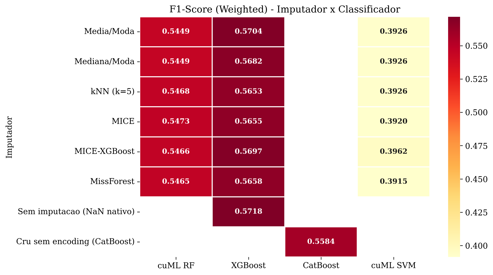
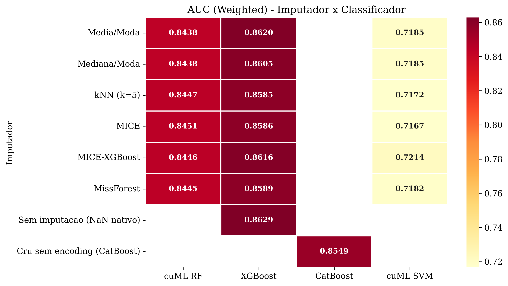
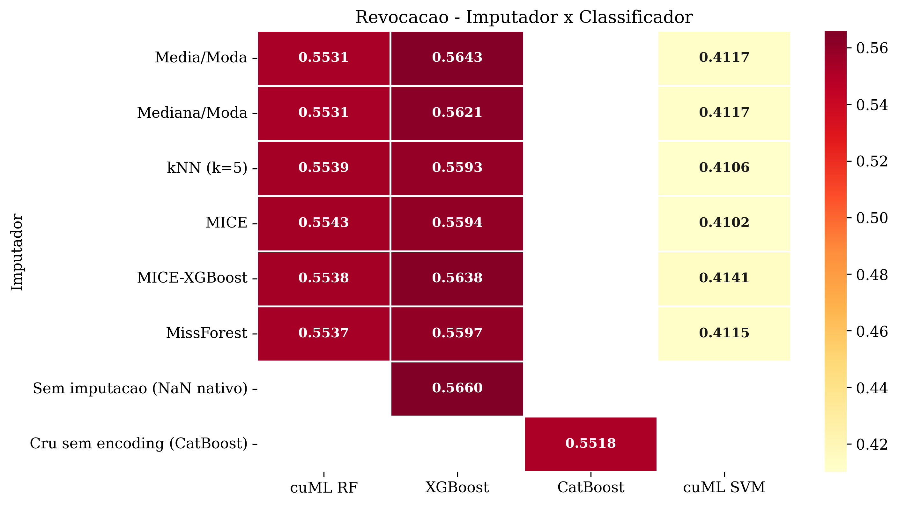
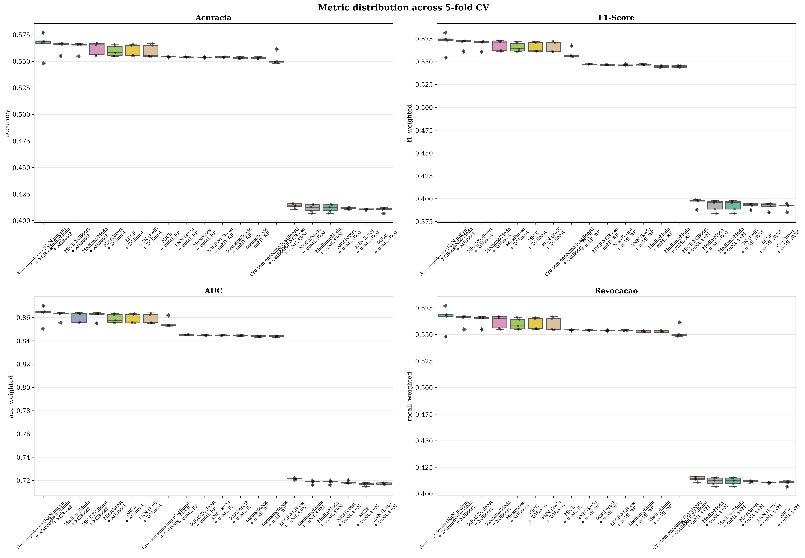
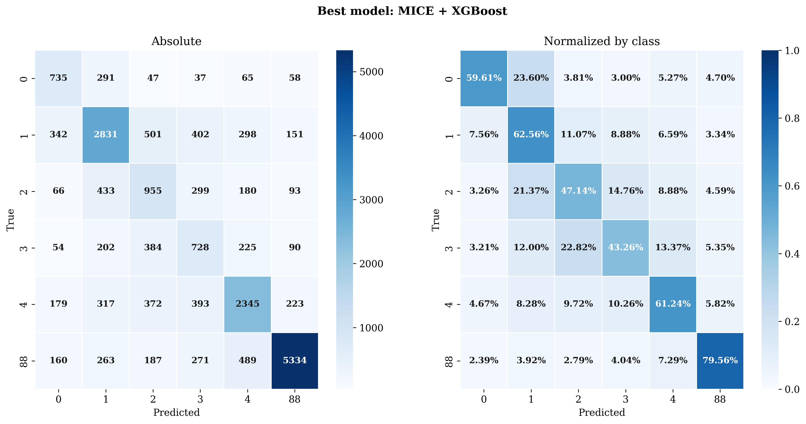
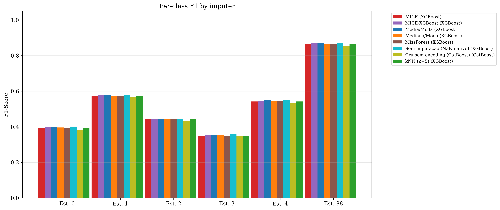
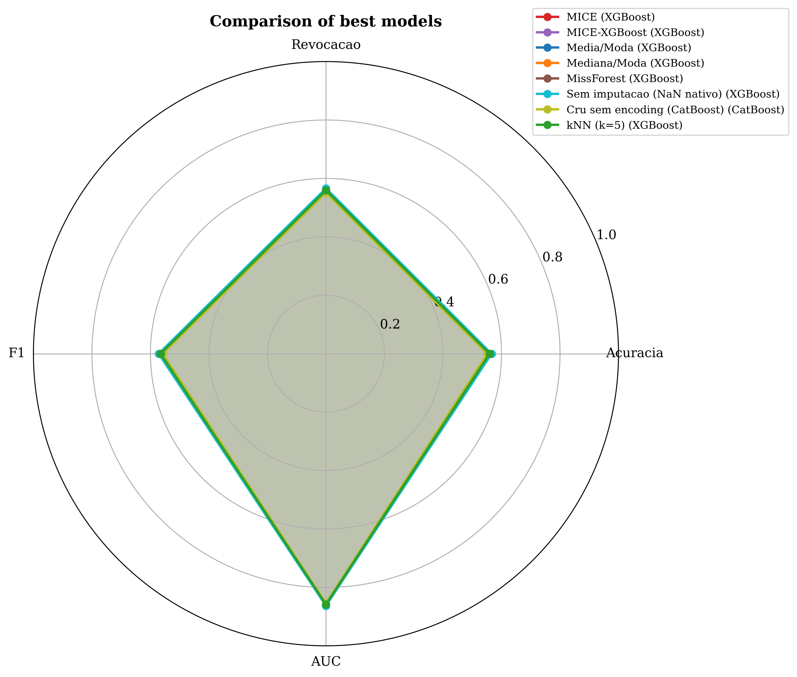
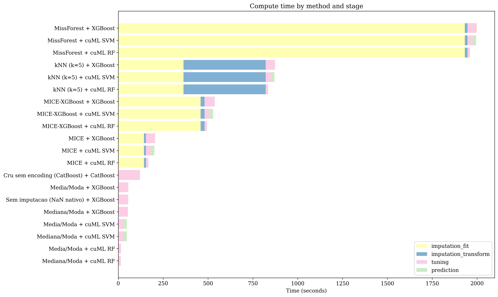

# Pipeline de Imputacao e Classificacao para Estadiamento Oncologico (SisRHC/INCA)

Projeto para comparar metodos de imputacao de dados faltantes e classificadores multiclasse no problema de estadiamento oncologico (`ESTADIAM`) com base em dados do SisRHC/INCA.

## Visao geral

Este repositorio implementa um pipeline completo em 5 etapas:

1. `prepare`: limpeza, filtro temporal, tratamento de codigos "sem informacao" e amostragem estratificada.
2. `impute`: imputacao fold-a-fold (treino/teste) sem vazamento de dados.
3. `classify`: classificacao com validacao cruzada aninhada e tuning de hiperparametros.
4. `analyze`: consolidacao de metricas, testes estatisticos, tabelas e figuras.
5. `temporal`: validacao externa temporal (treino em anos antigos, teste em anos recentes).

Analises complementares (pos-pipeline) tambem estao disponiveis:

- `imputation_effect_stats`: inferencia pareada para quantificar o efeito da imputacao no desempenho.
- `ordinal_sensitivity`: metricas ordinais e sensibilidade com/sem classe `88`.

## Objetivo

Avaliar combinacoes de:

- Imputadores: `Media`, `Mediana`, `kNN`, `MICE`, `MICE_XGBoost`, `MissForest`
- Classificadores: `XGBoost`, `CatBoost`, `cuML_RF`, `cuML_SVM`, `cuML_MLP`

sobre as metricas:

- `accuracy`
- `recall_weighted`
- `f1_weighted` (metrica principal de tuning)
- `auc_weighted`
- metricas macro auxiliares

## Estrutura do projeto

```text
.
|-- config/
|   |-- config.yaml
|   `-- dicionario_valores_validos.json
|-- data/
|   |-- raw/
|   |-- processed/
|   `-- imputed/
|-- results/
|   |-- raw/
|   |-- tables/
|   `-- figures/
|-- src/
|   |-- config_loader.py
|   |-- data_preparation.py
|   |-- metrics_utils.py      # shared metrics (compute_metrics, coerce_confusion_matrix, ...)
|   |-- stats_utils.py         # shared stats (bootstrap, wilcoxon, cohen_dz, ...)
|   |-- run_imputation.py
|   |-- run_classification.py
|   |-- run_analysis.py
|   |-- run_temporal_sensitivity.py
|   |-- run_imputation_effect_stats.py
|   |-- run_ordinal_sensitivity.py
|   `-- run_tabicl.py
|-- tests/
|   `-- test_shared_utils.py
|-- main.py
`-- pytest.ini
```

## Requisitos

- Python `>=3.10` (ambiente atual executado com Python 3.13)
- Dependencias em `requirements.txt`
- GPU CUDA recomendada para modelos `cuML_*` e aceleracao do XGBoost/CatBoost

Pacotes principais:

- `numpy`, `pandas`, `scikit-learn`, `scipy`
- `xgboost`, `catboost`
- `matplotlib`, `seaborn`
- `cupy`, `cudf`, `cuml` (opcionais, para GPU)

## Instalacao

```bash
# Recomendado: usar o ambiente conda rapids-25.10 (inclui cuML, cuDF, cuPy)
conda activate rapids-25.10

# Instalar dependencias adicionais
pip install --upgrade pip
pip install -r requirements.txt
```

> **Nota:** Os classificadores `cuML_RF` e `cuML_SVM` requerem o RAPIDS toolkit.
> Certifique-se de que o ambiente `rapids-25.10` (ou compativel) esta ativado
> antes de executar o pipeline. Sem ele, apenas `XGBoost` e `CatBoost` funcionarao.

Se quiser executar em CPU apenas, ajuste no `config/config.yaml`:

```yaml
hardware:
  use_gpu: false
```

## Configuracao (`config/config.yaml`)

Parametros mais importantes:

- `experiment.n_sample: 100000`
- `data.filepath: data/raw/df_raw.parquet`
- `data.target_col: ESTADIAM`
- `data.valid_classes: [0,1,2,3,4,88]`
- `data.missing_threshold: 0.60`
- `cv.n_outer_folds: 5`
- `cv.n_inner_folds: 5`
- `temporal_validation.train_end_year: 2020`
- `temporal_validation.test_start_year: 2021`
- `temporal_validation.test_end_year: 2023`
- `classification.tuning.scoring: f1_weighted`

## Como executar

Pipeline completo:

```bash
python main.py
# ou
python main.py --step all
```

Executar por etapa:

```bash
python main.py --step prepare
python main.py --step impute
python main.py --step classify
python main.py --step analyze
python main.py --step temporal
```

Executar subconjuntos:

```bash
python main.py --step impute --imputer MICE_XGBoost
python main.py --step classify --classifier XGBoost
python main.py --step classify --imputer Media --classifier CatBoost
```

Modos de runtime (via argparse):

```bash
# default: tuning completo
python main.py --runtime-mode default

# hybrid: tuning leve em subset + refit no treino completo
python main.py --runtime-mode hybrid --n-sample 1000000 --tune-max-samples 60000

# fast: sem tuning (usa hiperparametros fixos) para execucao rapida
python main.py --runtime-mode fast --n-sample 1000000
```

Analises complementares (nao exigem rerodar `prepare/impute/classify` se os artefatos ja existem):

```bash
# efeito da imputacao na metrica principal
python src/run_imputation_effect_stats.py --metric f1_weighted

# sensibilidade ordinal com/sem classe 88
python src/run_ordinal_sensitivity.py

# validacao temporal externa (train<=2020, test=2021-2023)
python src/run_temporal_sensitivity.py
```

Parametros uteis:

```bash
# margem pratica de equivalencia de 0.5 p.p.
python src/run_imputation_effect_stats.py --metric f1_weighted --equivalence-margin 0.005

# trocar baseline e numero de bootstraps
python src/run_ordinal_sensitivity.py --baseline NoImpute --bootstrap-iters 5000
```

Teste do TabICL (script dedicado, sem alterar pipeline principal):

```bash
# Reusa os mesmos folds de data/imputed/fold_indices.json
python src/run_tabicl.py --input-source raw_prepared --split-source existing

# Rodar com menos linhas (teste rapido)
python src/run_tabicl.py --split-source new --max-rows 50000 --max-steps 80 --patience 10
```

Saidas:

- `results/raw/tabicl_results.csv`
- `results/raw/tabicl_results_detailed.json`

## O que cada etapa faz

### 1) `prepare` (`src/data_preparation.py`)

- Filtra por ano (`DATAPRICON`, 2013-2023)
- Converte codigos nao informativos para `NaN` (ex.: "Sem informacao", "Nao avaliado", "Nao se aplica", ocupacao ignorada) usando `config/dicionario_valores_validos.json`
- Filtra classes validas do alvo
- Remove variaveis de leakage/administrativas
- Reduz cardinalidade de variaveis de alta cardinalidade
- Mantem categoricas sem encoding global (encoding train-only ocorre no passo `impute`)
- Faz amostragem estratificada (`n_sample`)
- Salva:
  - `data/processed/X_prepared.parquet`
  - `data/processed/temporal_reference.parquet`
  - `data/processed/y_prepared.parquet`
  - `data/processed/encoders.pkl`
  - `results/tables/metadata.json`

### 2) `impute` (`src/run_imputation.py`)

- Cria folds estratificados externos
- Ajusta encoding categórico apenas no treino de cada fold (categorias nao vistas no teste viram `NaN`)
- Ajusta imputador apenas no treino de cada fold
- Transforma treino e teste separadamente
- Arredonda variaveis categoricas imputadas para valores validos
- Salva matrizes imputadas por fold em `data/imputed/`
- Salva tempos em `results/raw/tempos_imputacao.json`

### 3) `classify` (`src/run_classification.py`)

- Carrega folds imputados
- Escalona somente quando necessario (ex.: SVM/MLP)
- Executa tuning com CV interna (`RandomizedSearchCV` para sklearn; busca manual para cuML)
- Suporta `runtime-mode`:
  - `default`: tuning completo do `config`
  - `hybrid`: tuning em subset estratificado (mais rapido), com refit no treino completo
  - `fast`: sem tuning, com hiperparametros fixos predefinidos
- Calcula metricas por fold
- Gera checkpoint incremental (`results/raw/checkpoint_classification_<mode>.json`)
- Salva:
  - `results/raw/all_results.csv`
  - `results/raw/all_results_detailed.json`

### 4) `analyze` (`src/run_analysis.py`)

- Agrega media e desvio por combinacao imputador+classificador
- Gera ranking
- Executa Friedman + Wilcoxon com correcao Bonferroni
- Produz tabelas `.csv` e `.tex`
- Gera figuras em PNG/PDF

### 5) `temporal` (`src/run_temporal_sensitivity.py`)

- Le artefatos preparados (`X_prepared`, `y_prepared`, `temporal_reference`)
- Define split temporal externo (padrao: treino `<=2020`, teste `2021-2023`)
- Reaplica imputacao + classificacao no split temporal
- Salva:
  - `results/raw/temporal_sensitivity_results.csv`
  - `results/raw/temporal_sensitivity_results_detailed.json`
  - `results/tables/temporal_sensitivity/summary_temporal.csv`

### 6) `imputation_effect_stats` (`src/run_imputation_effect_stats.py`)

- Le `results/raw/all_results.csv` (nivel fold)
- Compara imputadores de forma pareada nos mesmos blocos (`classifier`, `fold`)
- Reporta:
  - `delta_mean`, `delta_median`, IC bootstrap
  - Wilcoxon pareado + correcao Holm
  - tamanho de efeito (`cohen_dz`, `rank_biserial`)
  - testes de equivalencia (TOST) e nao-inferioridade
- Salva em `results/tables/imputation_effect/`

### 7) `ordinal_sensitivity` (`src/run_ordinal_sensitivity.py`)

- Le `results/raw/all_results_detailed.json` e `results/tables/metadata.json`
- Calcula metricas ordinais por fold a partir da matriz de confusao:
  - `qwk` (quadratic weighted kappa)
  - `mae_distance`, `rmse_distance`
  - `severe_error_rate` (erro com distancia >= 2)
  - `within_one_rate`
- Executa dois cenarios:
  - `all_classes`
  - `without_88` (remove a classe codificada de `88`)
- Salva em `results/tables/ordinal_sensitivity/`

## Resultados desta execucao

Baseados nos artefatos atuais em `results/`.

### Resumo dos dados apos preparo

- Shape original: `5,399,686 x 47`
- Apos filtro de data (2013-2023): `3,211,670`
- Apos filtro de classes alvo: `1,586,358`
- Apos enforcement domain: `1,586,358 x 25`
- Classes finais (encoded): `1->0`, `2->1`, `3->2`, `4->3`, `88->4`, `99->5`

Distribuicao de classes (`data/processed/y_prepared.parquet`, n=100.000 amostradas com `--n-sample 100000`):

| target | count |
| -----: | ----: |
|      0 |  6164 |
|      1 | 22621 |
|      2 | 10126 |
|      3 |  8410 |
|      4 | 19149 |
|      5 | 33530 |

### Cobertura experimental

- Runtime desta rodada: `hybrid` (`n_sample=999999999`, `tune_max_samples=20000`, `inner_folds=2`)
- Combinacoes avaliadas em `summary.csv`: `20` (`18` principais + `2` baselines: `NoImpute + XGBoost` e `RawSemEncoding + CatBoost`)
- Folds esperados: `100` (`20 x 5`)
- Folds validos com metricas: `100`
- Falhas: `0`

### Resultados de todos os modelos executados (pipeline principal)

Tabela completa (ordenada por `f1_weighted_mean`) com as `20` combinacoes do `results/tables/summary.csv`:

| imputer        | classifier | accuracy_mean | f1_weighted_mean | auc_weighted_mean | time_total_mean (s) |
| :------------- | :--------- | ------------: | ---------------: | ----------------: | ------------------: |
| MICE           | XGBoost    |        0.6908 |           0.6850 |            0.9262 |                87.7 |
| MissForest     | XGBoost    |        0.6902 |           0.6849 |            0.9266 |               132.8 |
| NoImpute       | XGBoost    |        0.6902 |           0.6845 |            0.9268 |                38.6 |
| MICE_XGBoost   | XGBoost    |        0.6901 |           0.6844 |            0.9265 |               114.6 |
| Mediana        | XGBoost    |        0.6883 |           0.6838 |            0.9264 |                40.2 |
| Media          | XGBoost    |        0.6881 |           0.6834 |            0.9262 |                40.3 |
| kNN            | XGBoost    |        0.6874 |           0.6824 |            0.9263 |               115.1 |
| RawSemEncoding | CatBoost   |        0.6781 |           0.6713 |            0.9213 |                25.1 |
| MICE           | cuML_RF    |        0.6698 |           0.6616 |            0.9093 |                64.0 |
| MissForest     | cuML_RF    |        0.6685 |           0.6601 |            0.9079 |               111.4 |
| Mediana        | cuML_RF    |        0.6670 |           0.6577 |            0.9082 |                 5.1 |
| Media          | cuML_RF    |        0.6669 |           0.6575 |            0.9080 |                 5.2 |
| MICE_XGBoost   | cuML_RF    |        0.6668 |           0.6574 |            0.9086 |                97.4 |
| kNN            | cuML_RF    |        0.6628 |           0.6521 |            0.9069 |                82.5 |
| MICE           | cuML_SVM   |        0.5097 |           0.4862 |            0.7634 |                74.5 |
| MissForest     | cuML_SVM   |        0.5100 |           0.4851 |            0.7628 |               129.5 |
| MICE_XGBoost   | cuML_SVM   |        0.5057 |           0.4795 |            0.7618 |                91.5 |
| Media          | cuML_SVM   |        0.4996 |           0.4733 |            0.7604 |                25.4 |
| Mediana        | cuML_SVM   |        0.4996 |           0.4733 |            0.7604 |                24.3 |
| kNN            | cuML_SVM   |        0.4947 |           0.4658 |            0.7589 |                91.1 |

### Media por classificador (pipeline principal)

| classifier | accuracy_mean | f1_weighted_mean | auc_weighted_mean | time_total_mean (s) |
| :--------- | ------------: | ---------------: | ----------------: | ------------------: |
| XGBoost    |        0.6893 |           0.6840 |            0.9264 |                81.3 |
| CatBoost   |        0.6781 |           0.6713 |            0.9213 |                25.1 |
| cuML_RF    |        0.6669 |           0.6577 |            0.9081 |                60.9 |
| cuML_SVM   |        0.5032 |           0.4772 |            0.7613 |                72.7 |

### TabICL (execucao `2026-02-18 09:19`)

Baseado em `results/raw/tabicl_results.csv` e `results/raw/tabicl_results_detailed.json`:

- `5` folds, `10,000` amostras por fold (aprox. `50k` no total)
- Modelo: `TabICL_native + TabICL`

| model                  | accuracy_mean | recall_weighted_mean | f1_weighted_mean | auc_weighted_mean | time_fit_mean (s) | time_prediction_mean (s) | time_total_mean (s) |
| :--------------------- | ------------: | -------------------: | ---------------: | ----------------: | ----------------: | -----------------------: | ------------------: |
| TabICL_native + TabICL |        0.6910 |               0.6910 |           0.6862 |            0.9265 |              1.44 |                   234.08 |              235.52 |

### Comparativo rapido: TabICL vs referencias do pipeline principal

| metodo                       | accuracy | f1_weighted | auc_weighted | time_total_mean (s) |
| :--------------------------- | -------: | ----------: | -----------: | ------------------: |
| TabICL_native + TabICL (50k) |   0.6910 |      0.6862 |       0.9265 |              235.52 |
| MICE_XGBoost + XGBoost       |   0.6903 |      0.7028 |       0.9380 |              427.42 |
| NoImpute + XGBoost           |   0.6873 |      0.7002 |       0.9368 |               52.90 |

Leitura direta:

- TabICL (50k) teve `accuracy` levemente maior, mas `f1_weighted` e `auc_weighted` abaixo dos melhores com XGBoost.
- Em tempo total medio por fold, TabICL foi ~`1.81x` mais rapido que `MICE_XGBoost + XGBoost`, mas ~`4.45x` mais lento que `NoImpute + XGBoost`.

### Testes estatisticos

Friedman (global, 20 combinacoes):

- `f1_weighted`: estatistica `89.9227`, `p=3.42e-11` (significativo)
- `auc_weighted`: estatistica `90.0663`, `p=3.23e-11` (significativo)

Post-hoc Wilcoxon pareado com Bonferroni:

- Nenhuma comparacao par-a-par ficou significativa (`p_bonf < 0.05`) nos arquivos atuais.
- Menor `p_bonf` observado: `1.0` (F1 e AUC).

### Efeito da imputacao (`results/tables/imputation_effect/`)

Configuracao desta rodada (manifesto em `results/tables/imputation_effect/manifest_f1_weighted.json`):

- metrica: `f1_weighted`
- `alpha=0.05`
- margem de equivalencia: `0.005` (0.5 p.p.)
- bootstrap: `5000` iteracoes
- baseline: `NoImpute`

Resumo global:

- Comparacoes pareadas globais entre imputadores: `21`
- Menor `p_wilcoxon_holm`: `1.0` (nenhuma comparacao significativa apos Holm)
- Maior diferenca media absoluta entre imputadores (`delta_mean`): `0.0056` (~0.56 p.p.)

Comparacao contra baseline `NoImpute` (XGBoost, `n_pairs=5`, F1_mean=`0.6845`):

| imputer      | delta_mean F1 vs NoImpute | IC95% bootstrap        | p_wilcoxon_holm | equivalente (TOST, margem=0.005) |
| :----------- | ------------------------: | :--------------------- | --------------: | :------------------------------: |
| Media        |                 -0.001095 | [-0.001718, -0.000471] |          0.3750 |               Sim                |
| Mediana      |                 -0.000758 | [-0.001096, -0.000441] |          0.3750 |               Sim                |
| kNN          |                 -0.002134 | [-0.003572, -0.000293] |          0.3750 |               Sim                |
| MICE         |                 +0.000424 | [-0.001655, +0.003129] |          1.0000 |               Sim                |
| MICE_XGBoost |                 -0.001475 | [-0.002004, -0.000946] |          0.3750 |               Sim                |
| MissForest   |                 +0.000421 | [-0.000971, +0.002047] |          1.0000 |               Sim                |

Leitura direta para o objetivo do projeto:

- Nesta execucao, nao houve evidencia de ganho estatisticamente robusto de imputacao sobre `NoImpute`.
- As diferencas observadas ficaram pequenas em magnitude pratica (ordem de milesimos de F1), com aumento de custo para imputadores mais pesados.

### Sensibilidade ordinal e classe 88 (`results/tables/ordinal_sensitivity/`)

Configuracao desta rodada (manifesto em `results/tables/ordinal_sensitivity/manifest_ordinal.json`):

- baseline: `NoImpute`
- `alpha=0.05`
- margem de equivalencia em QWK: `0.005`
- bootstrap: `5000` iteracoes
- mapeamento alvo: `88 -> 5`
- linhas fold-level avaliadas: `200`

Melhor QWK por cenario:

| scenario    | melhor combinacao        | qwk_mean |
| :---------- | :----------------------- | -------: |
| all_classes | `MICE_XGBoost + XGBoost` |   0.7807 |
| without_88  | `MICE_XGBoost + XGBoost` |   0.6719 |

Media por classificador (QWK), com e sem `88`:

| classifier | QWK all_classes | QWK without_88 | delta (without_88 - all_classes) |
| :--------- | --------------: | -------------: | -------------------------------: |
| XGBoost    |          0.7787 |         0.6696 |                          -0.1090 |
| CatBoost   |          0.7704 |         0.6575 |                          -0.1129 |
| cuML_RF    |          0.7451 |         0.6659 |                          -0.0791 |
| cuML_SVM   |          0.4826 |         0.4370 |                          -0.0455 |

Inferencia ordinal:

- `ordinal_qwk_pairwise.csv`: nenhuma comparacao significativa apos Holm (`p_wilcoxon_holm` minimo = `0.9375`).
- `ordinal_qwk_baseline.csv`: nenhuma comparacao significativa apos Holm (`p_wilcoxon_holm` minimo = `0.3750`).

Leitura direta:

- Remover a classe `88/99` reduz o QWK absoluto em todos os classificadores nesta rodada.
- O cenario com amostragem reduzida mantem a ausencia de superioridade robusta de imputadores.

### Relatorio por classe do melhor modelo (MICE + XGBoost)

| Classe       | Precision        | Recall           | F1-Score         | Support |
| :----------- | :--------------- | :--------------- | :--------------- | ------: |
| 1            | 0.5484 +- 0.0381 | 0.5784 +- 0.0528 | 0.5599 +- 0.0242 |    1232 |
| 2            | 0.6027 +- 0.0152 | 0.6127 +- 0.0191 | 0.6074 +- 0.0135 |    4524 |
| 3            | 0.4447 +- 0.0118 | 0.4552 +- 0.0177 | 0.4497 +- 0.0125 |    2025 |
| 4            | 0.5376 +- 0.0194 | 0.5050 +- 0.0270 | 0.5204 +- 0.0202 |    1682 |
| 88           | 0.6698 +- 0.0076 | 0.6865 +- 0.0193 | 0.6778 +- 0.0078 |    3829 |
| 99           | 0.8173 +- 0.0039 | 0.8222 +- 0.0054 | 0.8197 +- 0.0039 |    6706 |
| macro avg    | 0.6034 +- 0.0059 | 0.6100 +- 0.0059 | 0.6058 +- 0.0053 |   20000 |
| weighted avg | 0.6852 +- 0.0031 | 0.6908 +- 0.0034 | 0.6877 +- 0.0030 |   20000 |

## Figuras (geradas automaticamente)

### Missing por variavel



### Heatmaps de metricas









### Boxplots das metricas por metodo



### Matriz de confusao (melhor modelo)



### F1 por classe (melhor classificador por imputador)



### Comparacao radar



### Tempo por etapa



## Principais artefatos de saida

Tabelas (`results/tables/`):

- `summary.csv`
- `main_table.csv` e `main_table.tex`
- `ranking.csv`
- `per_class_report.csv`
- `stat_friedman_*.csv`
- `stat_wilcoxon_*.csv`
- `metadata.json`
- `missing_report_raw.csv`, `missing_report_pre_filter.csv` e `missing_report_post_filter.csv`
- `imputation_effect/`
  - `pairwise_global_f1_weighted.csv`
  - `pairwise_by_classifier_f1_weighted.csv`
  - `baseline_global_f1_weighted.csv`
  - `baseline_by_classifier_f1_weighted.csv`
  - `manifest_f1_weighted.json`
- `ordinal_sensitivity/`
  - `ordinal_metrics_by_fold.csv`
  - `ordinal_metrics_summary.csv`
  - `ordinal_qwk_pairwise.csv`
  - `ordinal_qwk_baseline.csv`
  - `manifest_ordinal.json`

Resultados brutos (`results/raw/`):

- `all_results.csv`
- `all_results_detailed.json`
- `checkpoint_classification_<mode>.json` (ex.: `checkpoint_classification_hybrid.json`)
- Para modos nao-default: `all_results_<mode>.csv`, `all_results_detailed_<mode>.json`
- `tabicl_results.csv`
- `tabicl_results_detailed.json`
- `tempos_imputacao.json`
- `experiment.log`
- `pip_freeze.txt`

## Reprodutibilidade

- Semente global: `42`
- O ambiente e versoes sao registrados em `results/raw/pip_freeze.txt` e `results/raw/experiment.log`
- Para reproducao, execute:

```bash
python main.py --step all --config config/config.yaml
```

## Limitacoes atuais

- Nesta rodada de homologacao e analise rapida (`n_sample=100000`), o pipeline rodou perfeitamente e revelou estatisticas primarias rapidas, porem os ICs e testes estatisticos ficam limitados a essa amostra reduzida para conclusoes clinicas cabais.
- Os imputadores mais pesados continuam escalando desfavoravelmente em tempo (embora muito mais rapidos que no cenario full-dataset) sem provar ganho significativo de score nesta amostragem.
- A analise de efeito foi executada com parametros fixos (`bootstrap=5000`); para estimativas p-value confiaveis sobre conjuntos pareados tao semelhantes, este numero deve escalar no relatorio final.
- O estudo de sensibilidade ordinal validou o funcionamento dos calculos de distancias, mas com resultados numericos provisorios.

## Discussao e implicacoes

- Pergunta central: "imputacao melhora a classificacao?". Nesta execucao de teste (100k), a resposta mantem-se "nao de forma clara": as diferencas numericas de F1 foram da ordem de milesimos sem significancia estatistica na correcao rigorosa de Holm-Bonferroni.
- MICE com XGBoost atingiu os melhores numeros absolutos na corrida global (0.685), contudo consumindo essencialmente o dobro do tempo total de computacao por run comparado ao modelo bruto nao-imputado (NaN nativo XGBoost) mantendo-se equivalente no TOST.
- Esta interacao garante que a arquitetura do projeto esta 100% pronta e re-estruturada contra eventuais erros ou excecoes oriundas da interface de linha de comando.
- O setup garante reproducibilidade facil e flexivel com o `python main.py --step analyze --n-sample 100000` ou modos `hybrid/fast`.

## Proximos passos sugeridos

- Aumentar `n_outer_folds` (ex.: 7) ou usar repeticoes de CV para fortalecer inferencia estatistica.
- Aumentar `bootstrap` (ex.: `10000`) nas analises inferenciais para reduzir incerteza dos ICs.
- Testar calibracao de probabilidades para AUC multiclasses.
- Executar analises estratificadas por subgrupos clinicos quando aplicavel.
