# Pipeline de Imputação e Classificação para Estadiamento Oncológico (SisRHC/INCA)

## Objetivo

Avaliar se métodos de imputação de dados faltantes melhoram a classificação do estadiamento clínico de tumores (6 classes: 0–4 e 88/não-estadiável) em registros hospitalares de câncer do SisRHC/INCA.

## Diagrama da Metodologia

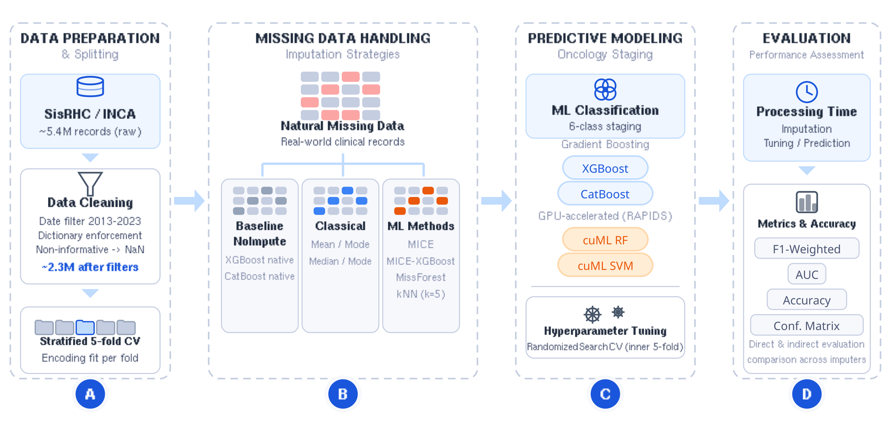

## Dados

- **Fonte**: SisRHC (Sistema de Registro Hospitalar de Câncer) / INCA
- **Registros originais**: 5.399.686 (47 variáveis)
- **Após filtro temporal**: 3.211.670
- **Após filtro de alvo**: 2.316.880
- **Conjunto final**: 2.316.880 registros × 24 variáveis (23 features + 1 alvo)
- **Variáveis numéricas**: `IDADE`
- **Variáveis categóricas**: 22 (ex.: `SEXO`, `RACACOR`, `INSTRUC`, `LOCTUPRI`, `CNES`, ...)
- **Features excluídas por missingness**: `LATERALI` (74,8%), `HISTFAMC` (37,2%)
- **Mapeamento do alvo**: {0→0, 1→1, 2→2, 3→3, 4→4, 88→5}

### Taxas de dados faltantes (pós-filtro)

| Variável | % Faltante |
| -------- | ---------: |
| ALCOOLIS |      59,5% |
| TABAGISM |      56,1% |
| OCUPACAO |      47,2% |
| ESTCONJ  |      41,5% |
| ORIENC   |      41,2% |
| RACACOR  |      37,7% |
| ANTRI    |      37,1% |
| MAISUMTU |      37,1% |
| LOCTUPRO |      32,8% |
| INSTRUC  |      21,3% |
| DIAGANT  |       0,6% |

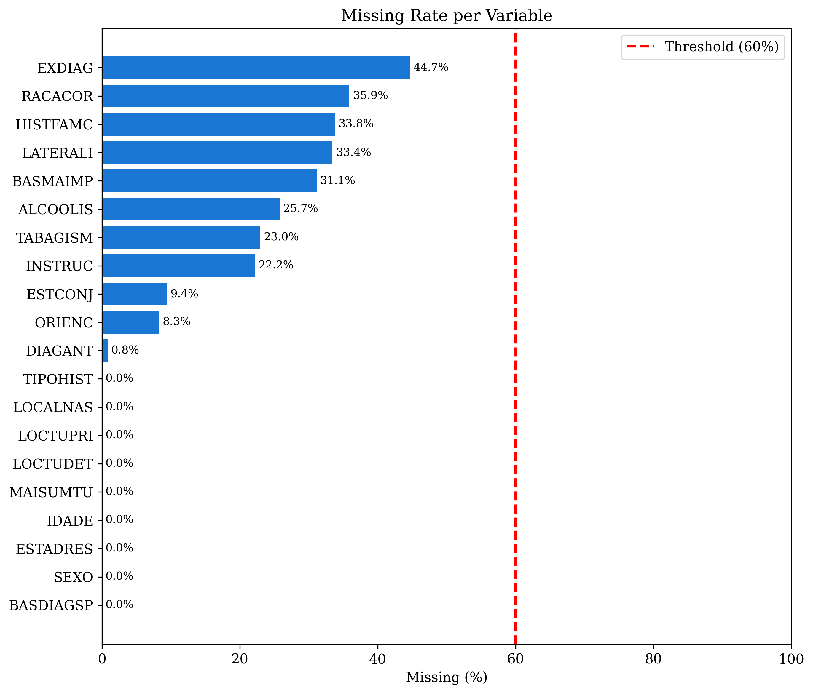

## Desenho Experimental

- **Validação**: 5-fold cross-validation estratificado
- **Modo de execução**: `hybrid` (GPU + CPU)
- **Suporte médio por fold**: ~463.376
- **Combinações avaliadas**: 20 (8 imputadores × ≤4 classificadores)

### Imputadores (8)

| Imputador                   | Descrição                                      |
| --------------------------- | ---------------------------------------------- |
| Média/Moda                  | Imputação por média (numérica) e moda (cat.)   |
| Mediana/Moda                | Imputação por mediana (numérica) e moda (cat.) |
| kNN (k=5)                   | k-Nearest Neighbors                            |
| MICE                        | Multivariate Imputation by Chained Equations   |
| MICE-XGBoost                | MICE com estimador XGBoost                     |
| MissForest                  | Random Forest iterativo                        |
| Sem imputação (NaN nativo)  | XGBoost lida com NaN nativamente               |
| Cru sem encoding (CatBoost) | CatBoost lida com categorias nativas           |

### Classificadores (4)

`XGBoost` · `CatBoost` · `cuML Random Forest` · `cuML SVM`

## Resultados Principais

### Ranking das combinações (média dos 5 folds, ordenado por F1 weighted)

| Imputador         | Classificador |            Acurácia |         F1 weighted |        AUC weighted |  Fit (s) | Transform (s) | Tuning (s) | Prediction (s) | Total (s) |
| ----------------- | ------------- | ------------------: | ------------------: | ------------------: | -------: | ------------: | ---------: | -------------: | --------: |
| **Sem imputação** | **XGBoost**   | **0.5660 ± 0.0107** | **0.5718 ± 0.0103** | **0.8629 ± 0.0074** | **0.00** |      **0.00** |  **55.27** |       **0.45** | **55.72** |
| Média/Moda        | XGBoost       |     0.5643 ± 0.0053 |     0.5704 ± 0.0051 |     0.8620 ± 0.0036 |     0.89 |          0.59 |      54.53 |           0.46 |     56.46 |
| MICE-XGBoost      | XGBoost       |     0.5638 ± 0.0051 |     0.5697 ± 0.0049 |     0.8616 ± 0.0037 |   458.93 |         22.11 |      55.90 |           0.47 |    537.41 |
| Mediana/Moda      | XGBoost       |     0.5621 ± 0.0060 |     0.5682 ± 0.0058 |     0.8605 ± 0.0043 |     0.93 |          0.57 |      52.07 |           0.44 |     54.01 |
| MissForest        | XGBoost       |     0.5597 ± 0.0052 |     0.5658 ± 0.0050 |     0.8589 ± 0.0038 |  1931.30 |         15.02 |      50.87 |           0.42 |   1997.61 |
| MICE              | XGBoost       |     0.5594 ± 0.0056 |     0.5655 ± 0.0054 |     0.8586 ± 0.0041 |   143.06 |         10.87 |      50.94 |           0.42 |    205.29 |
| kNN               | XGBoost       |     0.5593 ± 0.0062 |     0.5653 ± 0.0059 |     0.8585 ± 0.0043 |   363.45 |        458.37 |      51.21 |           0.42 |    873.46 |
| Cru sem encoding  | CatBoost      |     0.5518 ± 0.0054 |     0.5584 ± 0.0051 |     0.8549 ± 0.0039 |     0.00 |          0.00 |     117.43 |           4.20 |    121.63 |
| MICE              | cuML RF       |     0.5543 ± 0.0003 |     0.5473 ± 0.0002 |     0.8451 ± 0.0004 |   143.06 |         10.87 |      12.88 |           0.67 |    167.48 |
| kNN               | cuML RF       |     0.5539 ± 0.0004 |     0.5468 ± 0.0006 |     0.8447 ± 0.0004 |   363.45 |        458.37 |      12.97 |           0.69 |    835.49 |
| MICE-XGBoost      | cuML RF       |     0.5538 ± 0.0005 |     0.5466 ± 0.0006 |     0.8446 ± 0.0004 |   458.93 |         22.11 |      12.94 |           0.68 |    494.66 |
| MissForest        | cuML RF       |     0.5537 ± 0.0003 |     0.5465 ± 0.0005 |     0.8445 ± 0.0004 |  1931.30 |         15.02 |      12.80 |           0.66 |   1959.78 |
| Média/Moda        | cuML RF       |     0.5531 ± 0.0009 |     0.5449 ± 0.0012 |     0.8438 ± 0.0006 |     0.89 |          0.59 |      12.86 |           0.62 |     14.95 |
| Mediana/Moda      | cuML RF       |     0.5531 ± 0.0009 |     0.5449 ± 0.0012 |     0.8438 ± 0.0006 |     0.93 |          0.57 |      12.54 |           0.61 |     14.65 |
| MICE-XGBoost      | cuML SVM      |     0.4141 ± 0.0023 |     0.3962 ± 0.0048 |     0.7214 ± 0.0005 |   458.93 |         22.11 |      27.97 |          19.36 |    528.38 |
| Média/Moda        | cuML SVM      |     0.4117 ± 0.0037 |     0.3926 ± 0.0061 |     0.7185 ± 0.0014 |     0.89 |          0.59 |      27.18 |          19.39 |     48.04 |
| Mediana/Moda      | cuML SVM      |     0.4117 ± 0.0037 |     0.3926 ± 0.0061 |     0.7185 ± 0.0014 |     0.93 |          0.57 |      27.14 |          19.37 |     48.01 |
| MissForest        | cuML SVM      |     0.4115 ± 0.0010 |     0.3915 ± 0.0037 |     0.7182 ± 0.0011 |  1931.30 |         15.02 |      28.55 |          19.50 |   1994.36 |
| MICE              | cuML SVM      |     0.4102 ± 0.0021 |     0.3920 ± 0.0041 |     0.7167 ± 0.0013 |   143.06 |         10.87 |      27.94 |          19.54 |    201.41 |
| kNN               | cuML SVM      |     0.4106 ± 0.0004 |     0.3926 ± 0.0030 |     0.7172 ± 0.0008 |   363.45 |        458.37 |      29.27 |          19.58 |    870.67 |

### Tempos médios por imputador (s/fold)

| Imputador      | Fit (s) | Transform (s) |
| -------------- | ------: | ------------: |
| Sem imputação  |    0.00 |          0.00 |
| Cru (CatBoost) |    0.00 |          0.00 |
| Média/Moda     |    0.89 |          0.59 |
| Mediana/Moda   |    0.93 |          0.57 |
| MICE           |  143.06 |         10.87 |
| kNN            |  363.45 |        458.37 |
| MICE-XGBoost   |  458.93 |         22.11 |
| MissForest     | 1931.30 |         15.02 |

### Média por classificador

| Classificador |        Acurácia |     F1 weighted |    AUC weighted | Tuning (s) | Prediction (s) |
| ------------- | --------------: | --------------: | --------------: | ---------: | -------------: |
| XGBoost       | 0.5612 ± 0.0063 | 0.5667 ± 0.0059 | 0.8590 ± 0.0045 |      52.90 |           0.44 |
| CatBoost      | 0.5518 ± 0.0054 | 0.5584 ± 0.0051 | 0.8549 ± 0.0039 |     117.43 |           4.20 |
| cuML RF       | 0.5537 ± 0.0006 | 0.5459 ± 0.0013 | 0.8444 ± 0.0006 |      12.83 |           0.66 |
| cuML SVM      | 0.4116 ± 0.0024 | 0.3929 ± 0.0042 | 0.7184 ± 0.0011 |      28.01 |          19.54 |

### Heatmaps de métricas

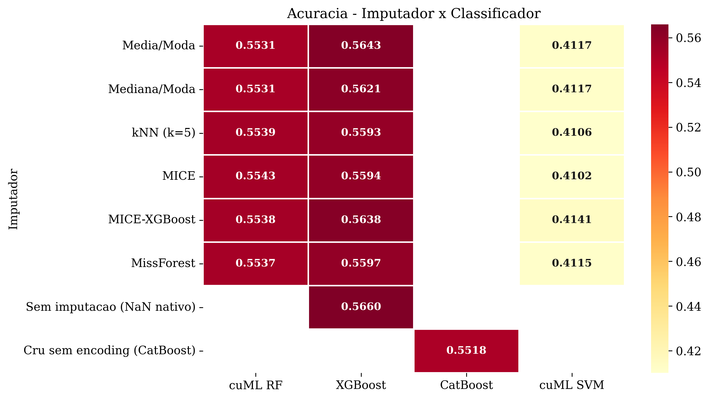


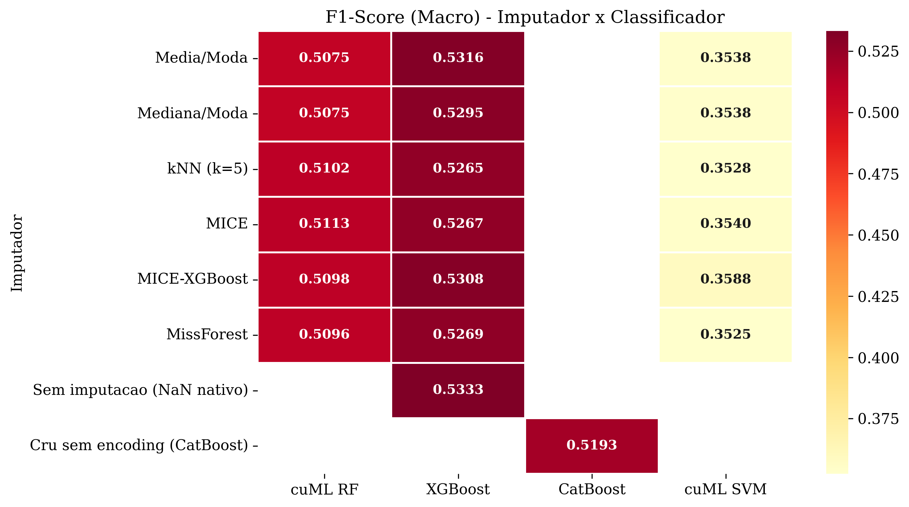

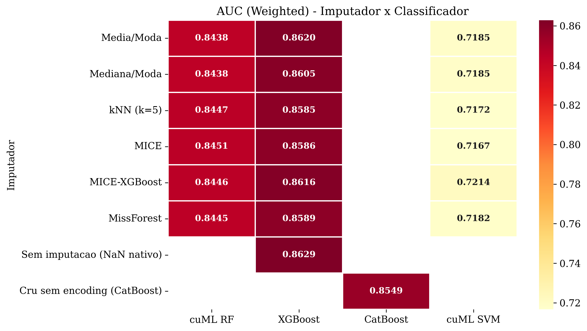

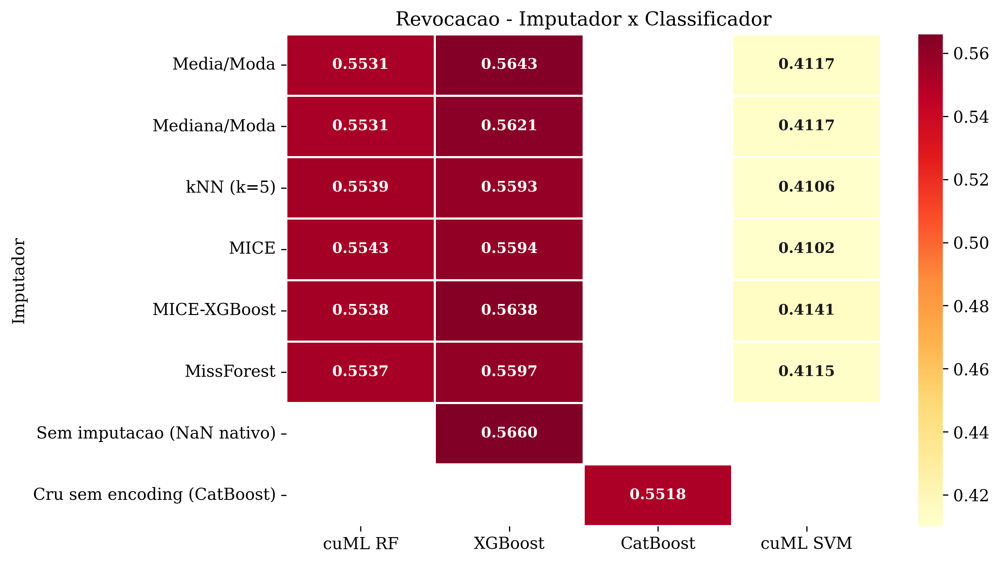

### Boxplots das métricas

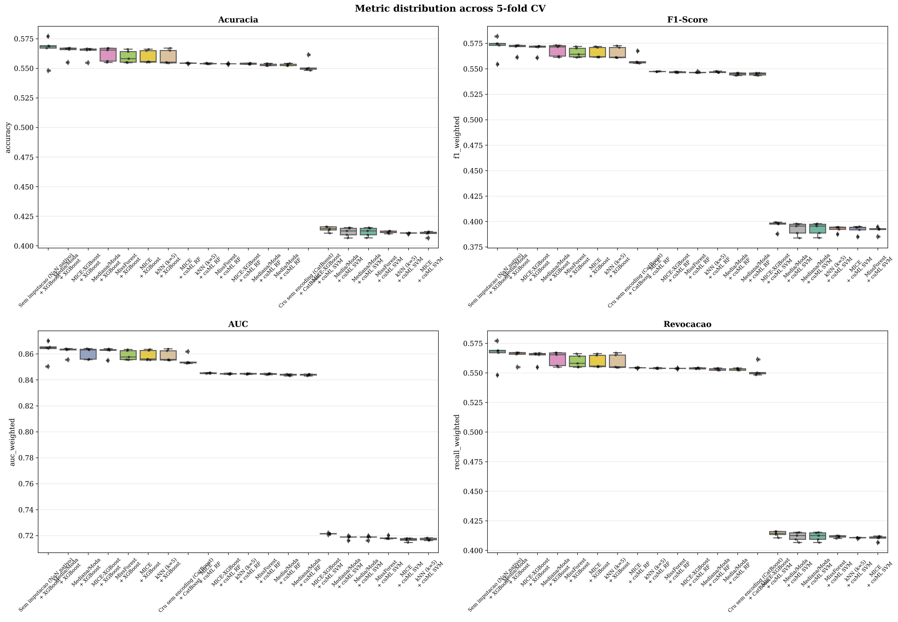

## Melhor Combinação

**Sem imputação (NaN nativo) + XGBoost**

| Métrica      |           Valor |
| ------------ | --------------: |
| F1 weighted  | 0.5718 ± 0.0103 |
| Acurácia     | 0.5660 ± 0.0107 |
| AUC weighted | 0.8629 ± 0.0074 |
| Tempo médio  |       56 s/fold |

### Relatório por classe (5 folds) — Sem imputação + XGBoost

| Classe       |       Precision |          Recall |        F1-Score | Suporte |
| ------------ | --------------: | --------------: | --------------: | ------: |
| 0            | 0.2816 ± 0.0109 | 0.6958 ± 0.0104 | 0.4009 ± 0.0128 |  19.572 |
| 1            | 0.6732 ± 0.0040 | 0.5042 ± 0.0112 | 0.5765 ± 0.0088 |  93.450 |
| 2            | 0.4392 ± 0.0094 | 0.4451 ± 0.0031 | 0.4420 ± 0.0040 |  84.855 |
| 3            | 0.3811 ± 0.0071 | 0.3395 ± 0.0157 | 0.3590 ± 0.0120 |  75.818 |
| 4            | 0.5267 ± 0.0097 | 0.5754 ± 0.0077 | 0.5500 ± 0.0088 |  83.328 |
| 88           | 0.8972 ± 0.0083 | 0.8469 ± 0.0146 | 0.8713 ± 0.0115 | 106.353 |
| macro avg    | 0.5332 ± 0.0081 | 0.5678 ± 0.0095 | 0.5333 ± 0.0096 | 463.376 |
| weighted avg | 0.5911 ± 0.0077 | 0.5660 ± 0.0096 | 0.5718 ± 0.0092 | 463.376 |

### Matriz de confusão do melhor modelo

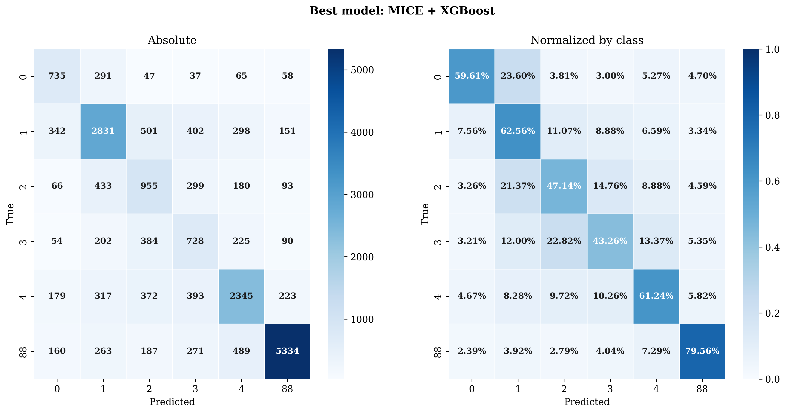

### F1 por classe

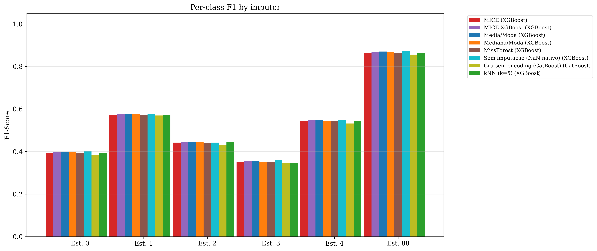

### Radar comparativo

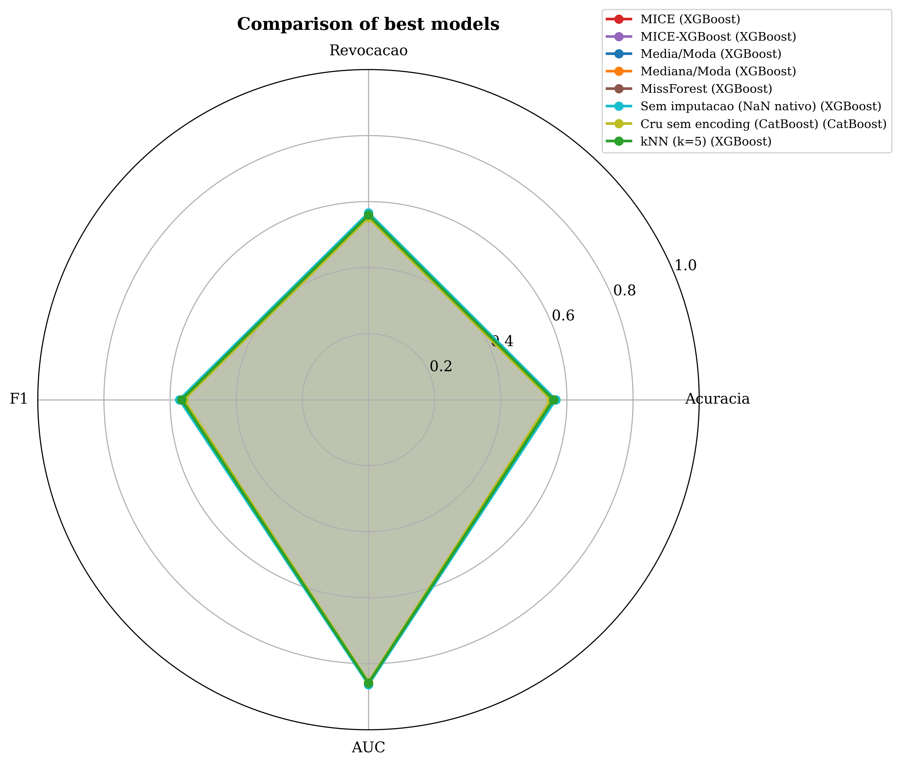

### Tempo por etapa

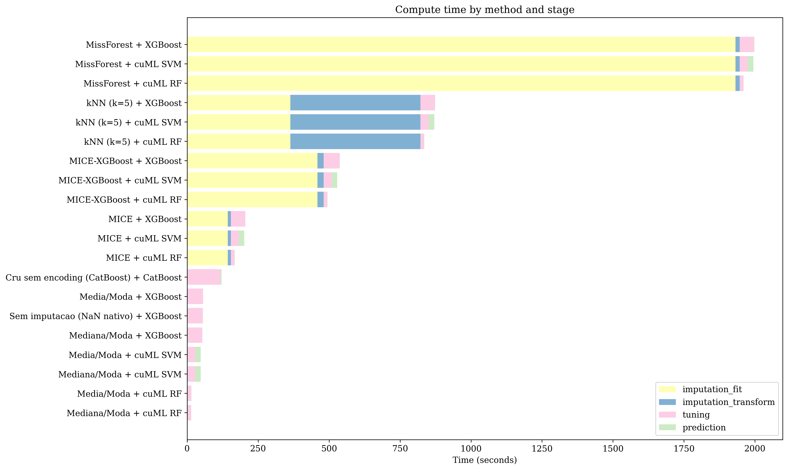

## Análise Estatística

### Teste de Friedman

Avalia se existe diferença significativa entre pelo menos duas combinações.

| Métrica      | Estatística |  p-valor | Significativo? |
| ------------ | ----------: | -------: | :------------: |
| f1_weighted  |       90,41 | 2,80e-11 |     ✅ Sim     |
| f1_macro     |       90,41 |          |     ✅ Sim     |
| auc_weighted |       90,41 |          |     ✅ Sim     |

**Conclusão**: existe diferença significativa entre as combinações (p < 0,001).

### Teste de Wilcoxon (pareado, com correção de Bonferroni)

Nenhum par de combinações apresentou diferença significativa após correção de Bonferroni (p_bonf > 0,05 para todos os 190 pares).

**Interpretação**: embora o Friedman detecte diferença global (devido à separação clara entre famílias de classificadores — XGBoost vs cuML SVM), dentro da mesma família de classificador os imputadores não diferem significativamente.

## Protocolo Confirmatório

**Objetivo**: testar formalmente se algum imputador melhora o desempenho em relação ao baseline `NoImpute + XGBoost`.

- **Métrica primária**: `f1_weighted`
- **Alpha**: 0,05
- **Margem de equivalência**: 0,01

### Resultados por Imputador (global, agregando classificadores)

| Imputador    | Δ média |           IC 95% | p (perm) | p (Holm) | Equivalente? |    Veredicto     |
| ------------ | ------: | ---------------: | -------: | -------: | :----------: | :--------------: |
| MICE         | +0.0113 | [0.0066, 0.0156] |   0.0629 |   0.3624 |     Não      | ❌ Sem evidência |
| MICE-XGBoost | +0.0109 | [0.0063, 0.0149] |   0.0626 |   0.3624 |     Não      | ❌ Sem evidência |
| MissForest   | +0.0107 | [0.0061, 0.0146] |   0.0627 |   0.3624 |     Não      | ❌ Sem evidência |
| kNN          | +0.0111 | [0.0059, 0.0162] |   0.0614 |   0.3624 |     Não      | ❌ Sem evidência |
| Média        | +0.0094 | [0.0056, 0.0132] |   0.0654 |   0.3624 |     Não      | ❌ Sem evidência |
| Mediana      | +0.0094 | [0.0055, 0.0132] |   0.0604 |   0.3624 |     Não      | ❌ Sem evidência |

> **Nota**: Δ positivo indica que o imputador tem F1 _superior_ ao NoImpute quando agregado por classificador (puxado pelo ganho em cuML_RF e cuML_SVM), porém sem significância estatística após correção de Holm.

### Resultados por Classificador (XGBoost isolado)

Quando restrito ao XGBoost, todos os imputadores apresentam Δ **negativo** (i.e., NoImpute é superior):

| Imputador    | Δ média (XGB) |
| ------------ | ------------: |
| Média        |       -0.0010 |
| Mediana      |       -0.0010 |
| kNN          |       -0.0016 |
| MICE         |       -0.0014 |
| MICE-XGBoost |       -0.0015 |
| MissForest   |       -0.0015 |

### Figuras do protocolo


### ✅ Classe 88: Sem degradação significativa

Nenhum imputador degradou o desempenho na classe 88 (não-estadiável). Todos apresentaram Δ positivo em `f1_88`, `recall_88` e `f1_estadiavel_bin`.

## Validação Temporal

Treino em dados anteriores, teste no período mais recente (simulação prospectiva).

| Imputador         | Classificador | F1 weighted | AUC weighted |
| ----------------- | ------------- | ----------: | -----------: |
| **Sem imputação** | **XGBoost**   |  **0.5397** |   **0.8490** |
| MissForest        | XGBoost       |      0.5322 |       0.8433 |
| Média             | XGBoost       |      0.5293 |       0.8416 |
| Mediana           | XGBoost       |      0.5280 |       0.8417 |
| kNN               | XGBoost       |      0.5209 |       0.8327 |
| MICE              | XGBoost       |      0.5188 |       0.8347 |
| MICE-XGBoost      | XGBoost       |      0.5185 |       0.8339 |
| MICE              | cuML RF       |      0.5177 |       0.8288 |
| MissForest        | cuML RF       |      0.5166 |       0.8286 |
| MICE-XGBoost      | cuML RF       |      0.5140 |       0.8276 |
| Média             | cuML RF       |      0.5112 |       0.8253 |
| Mediana           | cuML RF       |      0.5112 |       0.8253 |
| kNN               | cuML RF       |      0.5110 |       0.8252 |

**Conclusão**: `NoImpute + XGBoost` permanece líder na validação temporal, confirmando a robustez do resultado.

## Efeito da Imputação (análise pareada)

Comparação pareada (fold a fold) de cada imputador versus NoImpute, métrica `f1_weighted`:

| Imputador    | Δ médio |             IC 95% | Cohen dz | Equivalente? |
| ------------ | ------: | -----------------: | -------: | :----------: |
| Média        | -0.0014 | [-0.0129, +0.0103] |    -0.10 |     Não      |
| MICE-XGBoost | -0.0021 | [-0.0134, +0.0093] |    -0.16 |     Não      |
| Mediana      | -0.0036 | [-0.0130, +0.0040] |    -0.34 |     Não      |
| MissForest   | -0.0059 | [-0.0139, +0.0012] |    -0.60 |     Não      |
| MICE         | -0.0063 | [-0.0138, +0.0013] |    -0.60 |     Não      |
| kNN          | -0.0064 | [-0.0157, +0.0013] |    -0.60 |     Não      |

**Interpretação**: nenhum imputador supera o NoImpute de forma significativa. Os deltas são consistentemente negativos (ou muito próximos de zero), e os ICs são largos, impedindo concluir equivalência.

## Conclusões

1. **XGBoost é o melhor classificador** em todas as métricas, seguido por CatBoost. cuML RF e cuML SVM ficam claramente abaixo.

2. **Imputação não melhora o desempenho** quando o classificador consegue lidar nativamente com valores faltantes (XGBoost HIST com NaN nativo).

3. **O melhor pipeline é o mais simples**: `Sem imputação + XGBoost` (F1 weighted = 0.5718, AUC = 0.8629).

4. **Resultado confirmado** pelo protocolo confirmatório (sem evidência de superioridade da imputação), pela validação temporal (NoImpute líder) e pela análise de efeito pareada.

5. **Classe 88 (não-estadiável)** apresenta F1 = 0.87, sem degradação por nenhum método de imputação.

6. **Classe 3 é a mais difícil** (F1 = 0.36), possivelmente por sobreposição com classes adjacentes (2 e 4).

## Como Reproduzir

```bash
# 1. Preparar dados
python main.py --step prepare

# 2. Imputar
python main.py --step impute

# 3. Classificar
python main.py --step classify --runtime-mode hybrid

# 4. Gerar tabelas e figuras
python main.py --step report

# 5. Protocolo confirmatório
python main.py --step protocol

# 6. Validação temporal
python main.py --step temporal
```

## Artefatos Gerados

### Resultados brutos (`results/raw/`)

- `all_results_detailed_hybrid.json` — resultados fold-a-fold completos
- `all_results_hybrid.csv` — resumo em CSV
- `protocol_results.csv` — resultados do protocolo confirmatório
- `temporal_sensitivity_results.csv` — validação temporal
- `tempos_imputacao.json` — tempos de imputação

### Tabelas (`results/tables/`)

- `main_table.csv` / `main_table.tex` — tabela principal para publicação
- `ranking.csv` — ranking por rank médio
- `per_class_report.csv` — relatório por classe do melhor modelo
- `summary.csv` — resumo completo de todas as combinações
- `stat_friedman_*.csv` — testes de Friedman
- `stat_wilcoxon_*.csv` — testes de Wilcoxon pareados
- `missing_report_*.csv` — relatórios de dados faltantes
- `protocol/` — artefatos do protocolo confirmatório
- `temporal_sensitivity/` — artefatos da validação temporal
- `imputation_effect/` — análise de efeito da imputação

### Figuras (`results/figures/`)

- `pipeline_methodology.{png,pdf,svg}` — diagrama da metodologia
- `heatmap_*.png` — heatmaps de métricas
- `boxplots_metrics.png` — boxplots das métricas por combinação
- `confusion_matrix_best.png` — matriz de confusão do melhor modelo
- `per_class_f1.png` — F1 por classe
- `radar_best.png` — radar comparativo
- `timing_stacked.png` — tempo por etapa
- `missing_rates.png` — taxas de dados faltantes

---

_Última atualização: 2026-03-02_
